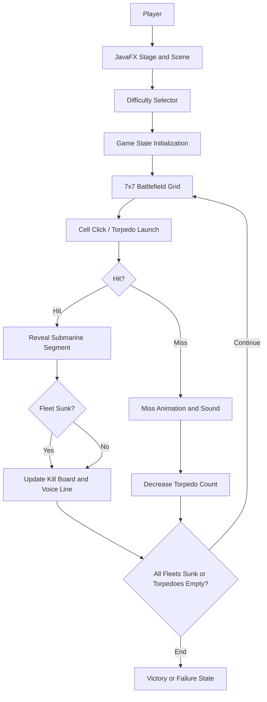
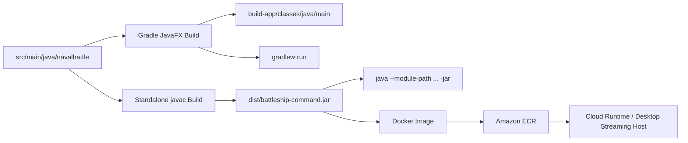
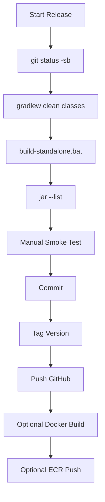

# Enterprise JavaFX Repository Guide

This guide explains the repository structure, runtime flow, debugging workflow, artifact checks, and deployment patterns for the Battleship Command JavaFX application.

## Repository Structure

```text
.
|-- .gitignore
|-- README.md
|-- build.gradle
|-- settings.gradle
|-- gradlew
|-- gradlew.bat
|-- run-gui.bat
|-- build-standalone.bat
|-- run-standalone.bat
|-- docs/
|   |-- architecture.md
|   |-- demo.md
|   |-- enterprise-guide.md
|   |-- index.md
|   |-- narrative.md
|   `-- screenshots/
|-- gradle/
|   `-- wrapper/
|-- legacy/
|   |-- README.md
|   |-- console/
|   `-- inactive-javafx/
`-- src/
    `-- main/
        `-- java/
            `-- navalbattle/
                |-- BattleshipFxApp.java
                `-- GameSounds.java
```

## Folder And Artifact Responsibilities

| Path | Purpose | Runtime Status |
| --- | --- | --- |
| `src/main/java/navalbattle` | Supported JavaFX source package. | Active |
| `src/main/java/navalbattle/BattleshipFxApp.java` | JavaFX UI, game state, grid, animations, mission rules, and app entry point. | Active |
| `src/main/java/navalbattle/GameSounds.java` | Generated audio effects and Windows speech synthesis helper. | Active |
| `build.gradle` | Gradle application and JavaFX plugin configuration. Includes only `navalbattle/**`. | Active |
| `settings.gradle` | Gradle root project name. | Active |
| `gradlew`, `gradlew.bat`, `gradle/wrapper` | Reproducible Gradle launcher. | Active |
| `run-gui.bat` | Local Windows Gradle launch helper. | Active |
| `build-standalone.bat` | Gradle-free `javac` and `jar` packaging helper. | Active |
| `run-standalone.bat` | Gradle-free local jar launcher with JavaFX module path. | Active |
| `docs` | Architecture, runbooks, screenshots, demo notes, and operational guides. | Active |
| `deploy/docker/Dockerfile` | Container packaging for display-capable JavaFX runtimes. | Deployment |
| `deploy/ecr/*.ps1` | PowerShell helpers to build and push Docker images to Amazon ECR. | Deployment |
| `legacy` | Inactive code retained for reference and migration history. | Not runtime |
| `build-app`, `build`, `out`, `dist` | Generated outputs. Ignored by git. | Generated |
| `.idea` | IntelliJ IDEA local workspace metadata. Ignored by git. | Local only |

## Runtime Flow



## Build And Artifact Flow



## IntelliJ IDEA Setup

1. Open the repository folder in IntelliJ IDEA.
2. Let IntelliJ import the Gradle project from `build.gradle`.
3. Configure the Gradle JVM as JDK 24.
4. Confirm the main class is `navalbattle.BattleshipFxApp`.
5. Run with either:
   - Gradle task: `application > run`
   - Application configuration:
     - Main class: `navalbattle.BattleshipFxApp`
     - Module classpath: project main module
     - VM options when not using Gradle-managed JavaFX:
       ```text
       --module-path C:\javafx-sdk-21.0.5\lib --add-modules javafx.controls,javafx.graphics
       ```

## Debugging Runbook

### Local Gradle Debug

Use this when the project should behave exactly like the Gradle application build.

```powershell
$env:JAVA_HOME='C:\Users\rpuro\.jdks\temurin-24.0.2'
$env:Path="$env:JAVA_HOME\bin;$env:Path"
.\gradlew.bat clean classes
.\gradlew.bat run --debug-jvm
```

Then attach IntelliJ to port `5005`:

1. `Run > Edit Configurations`.
2. Add `Remote JVM Debug`.
3. Host: `localhost`.
4. Port: `5005`.
5. Start the remote debug configuration.

### IntelliJ Click-Through Debug

1. Open `src/main/java/navalbattle/BattleshipFxApp.java`.
2. Set breakpoints in event handlers, animation callbacks, or state update methods.
3. Open the Gradle tool window.
4. Right-click `Tasks > application > run`.
5. Select `Debug`.

### Standalone Debug

Build the jar:

```powershell
$env:JAVA_HOME='C:\Users\rpuro\.jdks\temurin-24.0.2'
$env:JAVAFX_HOME='C:\javafx-sdk-21.0.5'
.\build-standalone.bat
```

Run with debugger enabled:

```powershell
java -agentlib:jdwp=transport=dt_socket,server=y,suspend=y,address=*:5005 `
  --module-path "$env:JAVAFX_HOME\lib" `
  --add-modules javafx.controls,javafx.graphics `
  -jar dist\battleship-command.jar
```

Attach IntelliJ to port `5005`.

## Failure Triage

| Symptom | Likely Cause | Check | Fix |
| --- | --- | --- | --- |
| `JAVA_HOME is not set` | JDK not configured. | `echo $env:JAVA_HOME` | Set `JAVA_HOME` to a JDK, not a JRE. |
| `Module javafx.controls not found` | JavaFX SDK missing from module path. | `dir $env:JAVAFX_HOME\lib` | Install JavaFX SDK and set `JAVAFX_HOME`. |
| App starts but no speech | Windows voice dependency unavailable. | Check PowerShell speech support. | Treat voice as optional; audio effects still run. |
| Gradle compiles unexpected code | Source set changed. | Inspect `build.gradle`. | Keep active include as `navalbattle/**`. |
| `clean` cannot delete `build-app` | File lock or OneDrive placeholder state. | Close IDEs/terminals using build output. | Retry outside synced folders or delete generated output after closing file handles. |
| Jar runs locally but not in container | JavaFX GUI needs display services. | Check container display/X server. | Use a desktop-capable host or virtual display. |

## Artifact Inspection Runbook

Clean and build Gradle classes:

```powershell
.\gradlew.bat clean classes
```

Inspect generated classes:

```powershell
Get-ChildItem build-app\classes\java\main\navalbattle
```

Build standalone jar:

```powershell
.\build-standalone.bat
```

Inspect jar contents:

```powershell
jar --list --file dist\battleship-command.jar
```

Inspect manifest:

```powershell
jar --describe-module --file dist\battleship-command.jar
```

Expected runtime classes:

```text
navalbattle/BattleshipFxApp.class
navalbattle/GameSounds.class
```

## Clean, Build, Run, Package Commands

| Action | Command |
| --- | --- |
| Clean Gradle outputs | `.\gradlew.bat clean` |
| Compile active app | `.\gradlew.bat classes` |
| Run with Gradle | `.\gradlew.bat run` |
| Run local helper | `.\run-gui.bat` |
| Build standalone jar | `.\build-standalone.bat` |
| Run standalone jar | `.\run-standalone.bat` |
| Show git status | `git status -sb` |
| Show latest commit | `git log -1 --oneline` |

## Docker And Cloud Deployment Model

JavaFX is a desktop UI framework, so a normal server container will not expose the GUI by itself. Use Docker for one of these enterprise scenarios:

- Build validation and artifact packaging in CI.
- Running the app on a cloud desktop host with a display server.
- Publishing a reproducible image to Amazon ECR for controlled runtime environments.

For headless cloud services, this application should be refactored into separate UI and service layers before deployment.

## Dockerfile

The repository includes `deploy/docker/Dockerfile`. It uses Gradle `installDist` so the generated start script and runtime jars are copied together. The image also installs common Linux libraries required by JavaFX display runtimes.

```powershell
docker build -f deploy/docker/Dockerfile -t battleship-command:2.0.0 .
docker run --rm battleship-command:2.0.0
```

For a runnable GUI container, provide a display strategy such as a cloud desktop, X forwarding, or a virtual framebuffer. Validate this with the target cloud runtime before treating it as production-ready.

## Amazon ECR Runbook

Set variables:

```powershell
$env:AWS_REGION='us-east-1'
$env:AWS_ACCOUNT_ID='<account-id>'
$env:ECR_REPOSITORY='battleship-command'
$env:IMAGE_TAG='2.0.0'
```

Create the ECR repository:

```powershell
aws ecr create-repository --repository-name $env:ECR_REPOSITORY --region $env:AWS_REGION
```

Authenticate Docker to ECR:

```powershell
aws ecr get-login-password --region $env:AWS_REGION |
  docker login --username AWS --password-stdin "$env:AWS_ACCOUNT_ID.dkr.ecr.$env:AWS_REGION.amazonaws.com"
```

Build and tag with the helper:

```powershell
.\deploy\ecr\build-image.ps1 -Repository $env:ECR_REPOSITORY -Tag $env:IMAGE_TAG
```

Push with the helper:

```powershell
.\deploy\ecr\push-image.ps1 `
  -AwsAccountId $env:AWS_ACCOUNT_ID `
  -AwsRegion $env:AWS_REGION `
  -Repository $env:ECR_REPOSITORY `
  -Tag $env:IMAGE_TAG
```

Verify:

```powershell
aws ecr describe-images --repository-name $env:ECR_REPOSITORY --region $env:AWS_REGION
```

## Enterprise Development Practices

- Keep active runtime code under `src/main/java/navalbattle`.
- Keep inactive experiments under `legacy` or remove them.
- Use Gradle wrapper commands in CI so builds are reproducible.
- Treat JavaFX SDK/module-path configuration as an explicit runtime dependency.
- Inspect jar contents before promotion.
- Tag releases with the same version as `build.gradle`.
- Add automated tests before changing game rules or state transitions.
- Keep generated folders out of source control.

## Release Checklist


